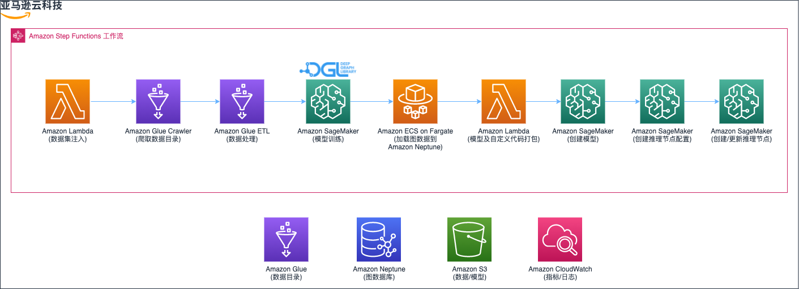
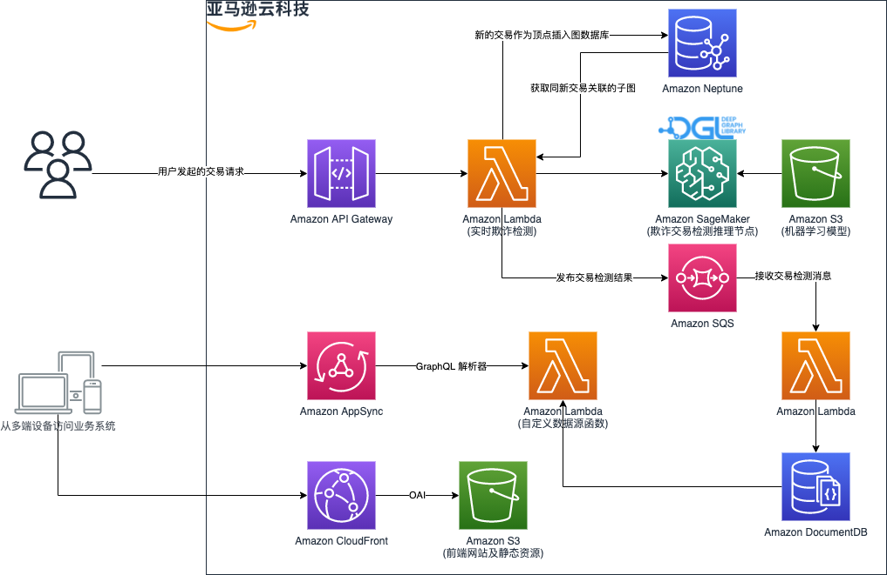
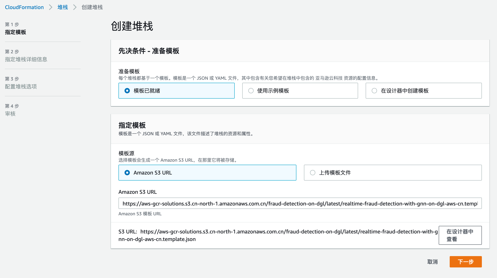
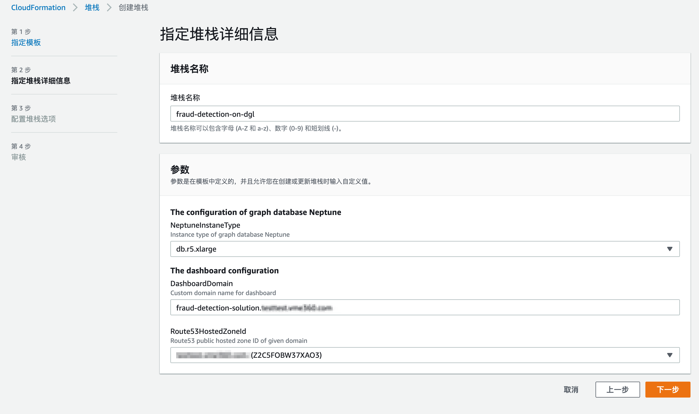
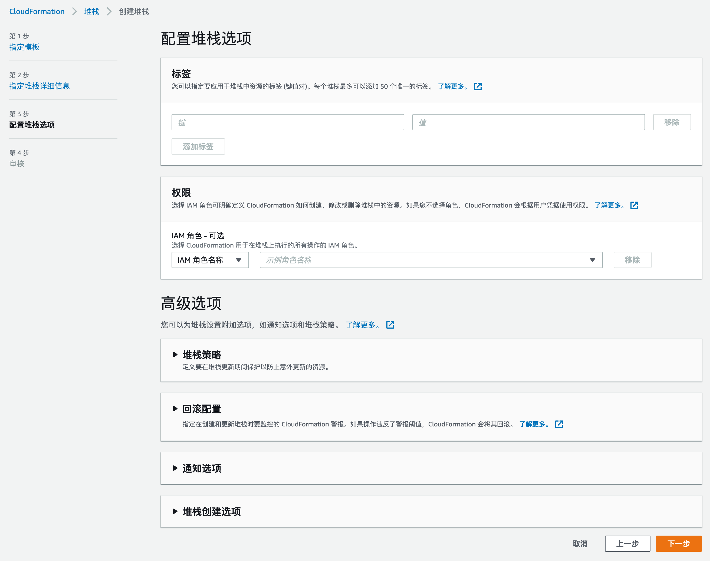
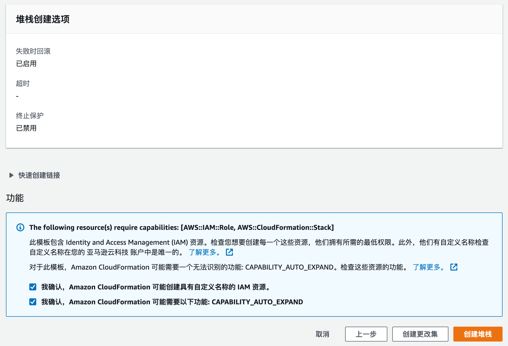
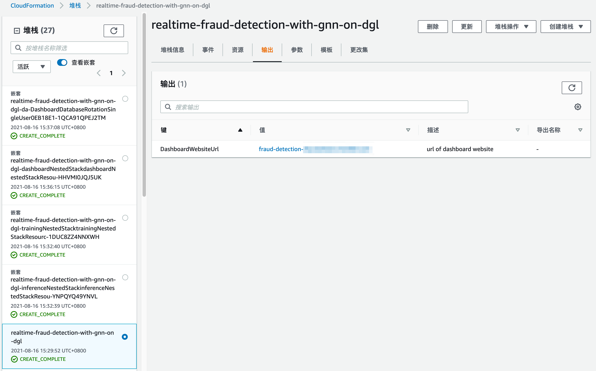
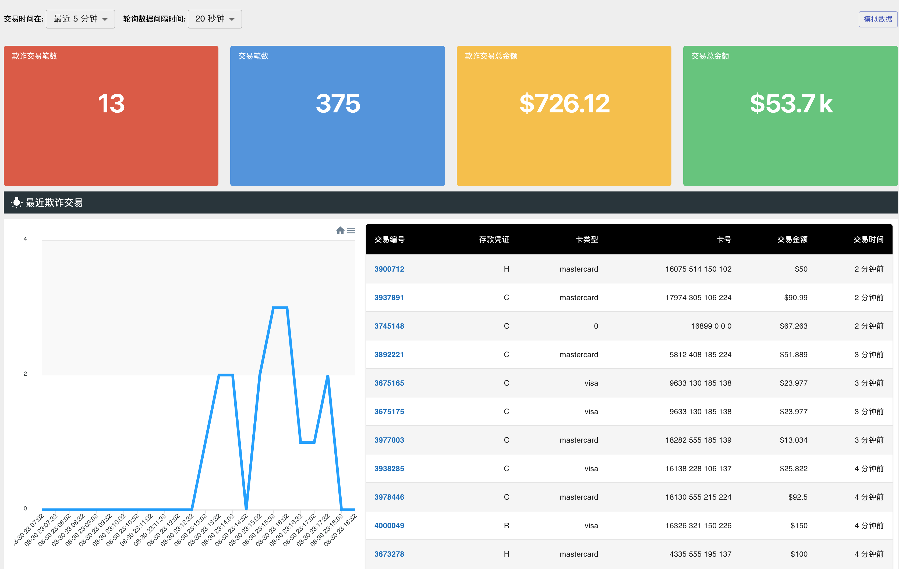

# 背景

本部署指南详细描述了如何在云上使用 Amazon CloudFormation 模板部署基于深度学习图神经网络的实时反欺诈解决方案。

# 解决方案描述

基于深度学习图神经网络的实时反欺诈解决方案是一个端到端的实时反欺诈解决方案参考实现，它使用 [Deep Graph Library][dgl](DGL) ，图数据库 [Amazon Neptune][neptune] , 机器学习 [Amazon SageMaker][sagemaker] 等服务，将 [IEEE-CIS][ieee-cis-dataset] 在线金融交易的表格数据转化为同构图数据，并训练图神经网络模型来实现欺诈交易的检测。

该解决方案包括以下主要功能：

- 基于 [Deep Graph Library][dgl](DGL) 构建领先的图神经网络模型
- 提供完整的模型训练及迭代流水线，各步骤包括数据注入、数据清洗、模型训练、模型更新上线
- 利用图数据库支持实时反欺诈的检测
- 可视化的业务监控系统

# 使用场景

此解决方案提供了一套基于深度学习图神经网络的实时反欺诈系统架构，可用于电商网站、视频直播、棋牌游戏、社交应用等各种场景。此方案可以帮助您的企业检测黑产造成的刷单炒信、数据爬取、 账户盗用、虚假申贷等非正常业务行为。

# 系统架构

## 区域可用性

本解决方案依赖 [Amazon Neptune][neptune] 和 [Amazon DocumentDB][documentdb] 存储图结构化数据和在线交易统计数据，由于服务的可用性区域要求，此解决方案可在由西云数据运营的亚马逊云科技中国（宁夏）区域和由光环新网运营的亚马逊云科技中国（北京）区域中部署，也可部署在亚马逊云科技以下海外区域，

- 美国东部（弗吉尼亚北部）区域:   us-east-1
- 美国东部（俄亥俄）区域:   us-east-2
- 美国西部（俄勒冈）区域:   us-west-2
- 加拿大（中部）区域:   ca-central-1
- 南美洲（圣保罗）区域:   sa-east-1
- 欧洲（爱尔兰）区域:   eu-west-1
- 欧洲（伦敦）区域:   eu-west-2
- 欧洲（巴黎）区域:   eu-west-3
- 欧洲（法兰克福）区域:   eu-central-1
- 亚太地区（东京）区域:   ap-northeast-1
- 亚太地区（首尔）区域:   ap-northeast-2
- 亚太地区（新加坡）区域:   ap-southeast-1
- 亚太地区（悉尼）区域:   ap-southeast-2
- 亚太地区（孟买）区域:   ap-south-1

## 架构图


      
图 1：构建图结构化数据、模型训练及部署的架构



图 2：实时反欺诈检测及业务监控系统的架构

## 组件

此解决方案在您的亚马逊云科技账户中部署五个 Amazon CloudFormation 模板并设置以下内容：

1. 第一个 Amazon CloudFormation 模板 `realtime-fraud-detection-with-gnn-on-dgl` 创建了：
    - 包含运行 [NAT 网关][nat-gateway] 和 [Internet 网关][igw]的 [Amazon Virtual Private Cloud][vpc] (Amazon VPC)。
    - 包含一个只读副本的图数据库 [Amazon Neptune][neptune] 集群，默认为 `db.r5.xlarge` 实例。
    - [Amazon SQS][sqs] 消息队列。
2. 第二个 CloudFormation 模板名为 `realtime-fraud-detection-with-gnn-on-dgl-trainingNestedStack` 开头，创建了：
    - [Amazon Step Functions][step-functions] 工作流从原始表格金融交易数据到训练基于图神经网络的模型，且部署为在线推理接口。
    - [Amazon Glue][glue] 数据目录及 ETL 作业，用于转换原始表格数据为图结构化数据。
    - 运行在 [Amazon ECS][ecs] 上的 [Amazon Fargate][fargate] 容器将图结构数据导入到图数据库 Amazon Neptune。
    - [Amazon SageMaker][sagemaker] 训练模型且部署模型为在线推理接口。
    - [Amazon Lambda][lambda] 函数完成原始数据注入、模型训练后处理等工作流步骤。
3. 第三个 CloudFormation 模板名为 `realtime-fraud-detection-with-gnn-on-dgl-inferenceNestedStack` 开头，创建了：
    - Amazon Lambda 函数实现了实时反欺诈推理接口。
4. 第四个 CloudFormation 模板名为 `realtime-fraud-detection-with-gnn-on-dgl-dashboardNestedStack` 开头，创建了： 
    - [Amazon DocumentDB][documentdb] 用于存储实时反欺诈检测过的在线交易及欺诈交易的属性，其用户秘钥保存在 [Amazon Secrets Manager][secrets-manager]。
    - [Amazon Lambda][lambda] 函数接收实时在线交易，并将它们保存在 DocumentDB 。
    - 部署在 [Amazon S3][s3] 且通过 [Amazon CloudFront][cloudfront] 分发的业务监控系统 Web 程序。
    - 使用 [Amazon API Gateway][api-gateway] 和 [Amazon AppSync][appsync] 实现的业务监控系统后端程序。
5. 第五个 CloudFormation 模板名为 `realtime-fraud-detection-with-gnn-on-dgl-DashboardDatabaseRotation` 开头，创建了： 
    - [Amazon Lambda][lambda] 函数周期性的轮换保存在 Secrets Manager 中的 DocumentDB 用户及秘钥。

为了实现冗余，Amazon VPC 使用两个可用区 (AZ) 中的子网创建，以实现高可用性。 NAT 网关、 Amazon Neptune、Amazon DocumentDB、 Amazon Glue 等资源部署在这两个可用区中。

# 部署说明

## 部署前提

1. 核实部署区域在本解决方案支持部署的可用区域列表中。
2. 请确认您的账户在目标部署区域具备创建 1 个 VPC 和 2 个 EIP 的配额，如已达到配额，请提交工单联系售后提升配额。

# 快速部署

本文的步骤主要针对在亚马逊云科技由西云数据运营宁夏区域中部署该解决方案，您可以使用以下链接快速启动一个 CloudFormation 堆栈来部署和管理整个方案：

## 启动CloudFormation堆栈

点击下方快速启动链接，打开亚马逊云科技管理控制台（如果还没登录会先跳转到登录页面，登录后进入模板启动页面）。

| 快速启动链接                                                                                                                                                                                                                                             | 描述                                                 |
| --------------------------------------------------- | ---------------------------------------------------- |
| [部署到由西云数据运营宁夏区域][deploy-to-zhy] | 在西云数据运营宁夏区域的新建 VPC 中部署解决方案 |
| [部署到美国东部（弗吉尼亚北部）区域][deploy-to-global] | 默认在美国东部（弗吉尼亚北部）区域的新建 VPC 中部署解决方案，可通过导航栏选择其他支持的区域 |



## 指定堆栈详细信息

|         参数        |    默认值    |                                                      描述                                                      |
|:-------------------:|:------------:|:--------------------------------------------------------------------------------------------------------------|
|  NeptuneInstaneType | db.r5.xlarge | 指定 Neptune 实例的类型，可选值包括，db.r5.xlarge、db.r5.2xlarge、db.r5.4xlarge、db.r5.8xlarge、db.r5.12xlarge |
|   DashboardDomain   |              |            指定解决方案部署的业务系统的自定义域名。**注意**：必须是下面选择的托管区域可解析的子域名            |
| Route53HostedZoneId |              |                                  选择当前部署账户的 `Route 53` 中公共托管区域                                  |



点击 **【下一步】**

## 配置堆栈选项

保持默认值



点击 **【下一步】**

## 审核堆栈

保持默认值，但请勾选 **我确认，Amazon CloudFormation 可能创建具有自定义名称的 IAM 资源** 和 **我确认，Amazon CloudFormation 可能需要以下功能: CAPABILITY_AUTO_EXPAND** 的单选框。



点击  **【创建堆栈】** 。

等待大概 30 分钟，堆栈创建完成。点击堆栈的 **【输出】** 标签页。



查看您指定的业务系统自定义域名。

# 使用解决方案

## 启动数据处理、模型训练及部署流水线

通过解决方案部署的 Amazon Step Functions 工作流来处理交易数据、训练基于图神经网络的深度学习反欺诈模型，最终部署模型推理节点。

1. 登录亚马逊云科技管理控制台。
2. 控制台中打开 Step Functions 服务，选择**状态机**。
    
3. 打开 **ModelTrainingPipeline** 名称开头的状态机，选择**启动执行**，使用默认输入值启动执行。

您可以在状态机执行任务详情信息查看执行状态。您会在大约三个小时内收到 `已成功` 状态。

> **注意**：
> 流水线的完整执行时间跟部署时指定的 Amazon Neptune 实例大小相关，选用 `db.r5.8xlarge` 或之上的实例，流水线执行时间在两个小时之内。

## 模拟在线交易请求

1. 访问解决方案部署时创建的业务监控系统。业务系统的访问域名可以在 Amazon CloudFormation 堆栈输出中找到。管理控制台中打开 CloudFormation 服务，打开堆栈 `realtime-fraud-detection-with-gnn-on-dgl` 或您自定义的堆栈名称，点击**输出**，查找键 `DashboardWebsiteUrl`，它的值是业务系统的 CloudFront 域名或您指定的自定义域名。
2. 点击**模拟数据**按钮，输入符合要求的模拟数据参数来指定模拟数据持续时间、并发个数以及模拟数据请求之间的间隔时间。或使用默认参数，将使用十个并发程序持续模拟在线交易请求五分钟，每个并发程序将间隔三秒发送一次在线交易请求。设置参数完成后，点击**模拟**按钮开始模拟在线交易。
    
3. 模拟程序后台将花费小于两分钟时间准备测试交易数据，在约三分钟后，监控系统将统计到在线交易的情况，包括默认最近五分钟内收到的交易请求笔数，以及实时反欺诈解决方案检测出的欺诈交易笔数。
    

# 清理解决方案部署

要卸载**基于深度学习图神经网络的实时反欺诈解决方案**，请删除 CloudFormation 堆栈。这将删除模板创建的所有资源，但 `realtime-fraud-detection-frauddetectiondatabucket` 开头命名的 S3 存储桶和 `realtime-fraud-detection-bucketaccesslog` 开头命名的存储桶除外。删除解决方案堆栈时将保留这两个存储桶，以帮助防止意外丢失数据。 您可以使用 Amazon 管理控制台或 Amazon CLI 清空，然后在删除 CloudFormation 堆栈后删除这些 S3 存储桶。

### 使用 Amazon 管理控制台

1. 登录 [CloudFormation][cloudformation-console] 控制台。
1. 选择此解决方案的安装父堆栈，如部署时的默认名称 `fraud-detection-on-dgl`。
1. 选择**删除**。

### 使用 Amazon CLI

确定命令行 (Amazon CLI) 在您的环境中是否可用。有关安装说明，请参阅 Amazon CLI 用户指南中的[Amazon CLI 是什么][aws-cli]。确认 Amazon CLI 可用后，运行以下命令。

```bash
aws cloudformation delete-stack --stack-name <installation-stack-name> --region <aws-region>
```

### 删除 Amazon S3 存储桶

基于深度学习图神经网络的实时反欺诈解决方案创建两个不会自动删除的 S3 存储桶。 要删除这些存储桶，请使用以下步骤。

1. 登录到 [Amazon S3][s3-console] 控制台。
1. 选择 `realtime-fraud-detection-frauddetectiondatabucket` 命名开头的存储桶。
1. 选择**空**。
1. 选择**删除**。
1. 选择 `realtime-fraud-detection-bucketaccesslog` 命名开头的存储桶。
1. 选择**空**。
1. 选择**删除**。

要使用 Amazon CLI 删除 S3 存储桶，请运行以下命令：

```bash
aws s3 rb s3://<bucket-name> --force
```

[ieee-cis-dataset]: https://www.kaggle.com/c/ieee-fraud-detection/
[dgl]: https://www.dgl.ai/
[neptune]: https://aws.amazon.com/neptune/
[sagemaker]: https://aws.amazon.com/sagemaker/
[cloudformation]: https://aws.amazon.com/cn/cloudformation/
[vpc]: https://aws.amazon.com/cn/vpc/
[nat-gateway]: https://docs.aws.amazon.com/vpc/latest/userguide/vpc-nat-gateway.html
[igw]: https://docs.aws.amazon.com/vpc/latest/userguide/VPC_Internet_Gateway.html
[sqs]: https://aws.amazon.com/cn/sqs/
[step-functions]: https://aws.amazon.com/cn/step-functions/
[glue]: https://aws.amazon.com/cn/glue/
[ecs]: https://aws.amazon.com/cn/ecs/
[fargate]: https://aws.amazon.com/cn/fargate/
[lambda]: https://aws.amazon.com/cn/lambda/
[documentdb]: https://aws.amazon.com/cn/documentdb/
[s3]: https://aws.amazon.com/cn/s3/
[cloudfront]: https://aws.amazon.com/cn/cloudfront/
[api-gateway]: https://aws.amazon.com/cn/api-gateway/
[appsync]: https://aws.amazon.com/cn/appsync/
[secrets-manager]: https://aws.amazon.com/cn/secrets-manager/
[deploy-to-zhy]: https://cn-northwest-1.console.amazonaws.cn/cloudformation/home?region=cn-northwest-1#/stacks/create/template?stackName=fraud-detection-on-dgl&templateURL=https://aws-gcr-solutions.s3.cn-north-1.amazonaws.com.cn/Realtime-fraud-detection-with-gnn-on-dgl-rel/latest/cn/realtime-fraud-detection-with-gnn-on-dgl.template.json
[deploy-to-global]: https://console.aws.amazon.com/cloudformation/home?region=us-east-1#/stacks/new?stackName=fraud-detection-on-dgl&templateURL=https://aws-gcr-solutions.s3.amazonaws.com/Realtime-fraud-detection-with-gnn-on-dgl-rel/latest/default/realtime-fraud-detection-with-gnn-on-dgl.template.json
[cloudformation-console]: https://cn-northwest-1.console.amazonaws.cn/cloudformation/home?region=cn-northwest-1
[aws-cli]: https://docs.amazonaws.cn/cli/latest/userguide/cli-chap-welcome.html
[s3-console]: https://console.amazonaws.cn/s3/home?region=cn-northwest-1#